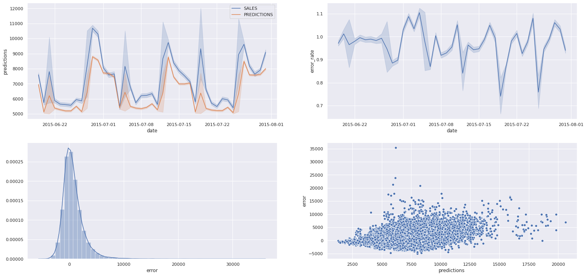

# Projeto de Previsão de Vendas - Rede de Farmácias Rossmann
## _Rossmann Sales Predict Project_

___

A Rossmann opera mais de 4.000 drogarias em 8 países europeus e cerca de 56 mil colaboradores.

A empresa disponibilizou os seus dados dentro da plataforma de competições de dados Kaggle. Foram disponibilizados um total de 1.017.209 registros das vendas realizadas pelas filias da empresa, contendo 18 características únicas para cada venda realizada.

## 1. Problema de Negócio

___

Inicialmente solicitado ao time de dados a realização da previsão de vendas de cada loja para as próximas 6 semanas, foi investigado junto ao CFO a finalidade dessa aplicação, que consiste no provisionamento dos valores obtidos para sanar a necessidade de reformas nas lojas de toda a franquia de modo a viabilizar melhorias estruturais visando melhor atendimento ao cliente final.

Atualmente, esses valores são calculados de forma individual, sendo que cada gerente realiza a entrega dessa previsão. Como cada loja possui fatores distintos que influenciam em seus resultados (i.e. promoções, competições por clientes, feriados, sazonalidade e etc) e os cálculos são feitos de forma manual, os resultados variam muito.

Dessa forma, a ideia deste projeto é auxiliar o CFO na tomada de decisão, provendo resultados das previsões de cada loja de forma automática e confiável, e possibilitando que o CFO consulte as previsões através de aplicações como um aplicativo web ou um bot no telegram.

## 2. Premissas de Negócio

___

Para a construção da solução, foram consideradas as seguintes premissas:

- A consulta da previsão de vendas estará disponível 24/7, e será acessível via aplicação web (Render ou Heroku), bem como pelo aplicativo do Telegram, onde o CFO digitará o código da loja, e como resposta, receberá o valor da previsão para as próximas 6 semanas.
- Foram consideradas para a previsão apenas as lojas que possuiam o valor de vendas superior a 0 na base de dados. O dia em que as lojas estavam fechadas foram também descartados para a realização das previsões  (i.e. Lojas que possam fornecer ganho de aprendizado ao modelo de __Machine Learning__.)
- Lojas que não possuíam dados de competidores próximos tiveram o valor da distância fixada em 200.000 metros.

### 2.1 Descrição dos Dados

___

| Atributo     | Descrição |
| ----------- | ----------- |
| Store      | Identificador único de cada loja (Id)      |
| Date   | Data em que ocorreu o evento de venda        |
| DayOfWeek      | Variável numérica que representa o dia da semana que ocorreu o evento de venda       |
| Sales   | Valor de Vendas do dia        |
| Customers      | Quantidade de clientes na loja no dia       |
| StateHoliday   | Indica se o dia em análise é feriado. a = Feriado público, b = Feriado de páscoa, c = Natal, 0 = Não há feriado       |
| SchoolHoliday      | Indica se a loja foi ou não fechada durante o feriado escolar.       |
| StoreType   | Indica o modelo de lojas. Pode variar entre as váriaveis categóricas a, b, c, d        |
| Assortment      | Indica o nível de variedade de produtos: a = básico, b = extra, c = estendido       |
| CompetitionDistance   | Distância (em metros) para o competidor mais próximo        |
| CompetitionOpenSince [Month/Year]      | Indica o ano e mês em que o competidor mais próximo abriu       |
| Promo  |Indica se a loja está com alguma promoção ativa no dia     |
| Promo2     | Indica se a loja deu continuidade na promoção: 0 = loja não está participando, 1 = loja participando       |
| Promo2Since [Year/Week]   | Descreve o ano e semana de quando a loja começa a a promoção extendida        |
| PromoInterval      | Descreve os meses em que a loja iniciou a promo2, ex.: "Feb,May,Aug,Nov" significa que a loja iniciou as promoções estendidas em cada um desses meses     |

## 3. Estratégia de Solução

___

Para fazer a entrega de uma primeira solução o mais rápido possível, de forma a entregar valor a empresa e possibilitar que o CFO tome decisões com mais agilidade, foi utilizado o método CRISP-DS

O método CRISP-DS consiste em um ciclo de 9 passos, onde a cada iteração completa, o resultado de negócio vai sendo aperfeiçoado, visando entregas cada vez mais rápidas e com resultados mais acertivos, possibilitando assim que as equipes que irão utilizar os resultados obtidos tenham um produto minimamente utilizável na primeira entrega e que é aperfeiçoado ao longo do tempo a medida que se obtém melhor compreensão das váriaveis e modelos que mais impactam o problema de negócio.

### 3.1 Passos do CRISP-DS

___

1. **Problema de Negócio**: Esta etapa tem como objtivo receber o problema de negócio que será resolvido. É nesta etapa que é recebido a pergunta ou o pedido feito pelo dono do problema, que no caso deste projeto, é o CFO da rede Rossmann.
2. **Entendimento de Negócio**: Esta etapa tem como objetivo entender a dor do dono do problema e qual a sua real necessidade. Nesta etapa podem surgir protótipos da solução para validar com o dono do problema o que ele deseja como solução.
3. **Coleta de Dados**: Esta etapa tem como objetivo realizar a coleta dos dados, buscando eles nas tabelas do(s) banco(s) de dados da empresa.
4. **Limpeza de Dados**: Esta etapa tem como objetivo remover toda e qualquer sujeira nos dados. Um dado sujo pode ser entendido como um dado que irá atrapalhar a performance final do algoritmo de Machine Learning, tomando-se o cuidado de entender bem o fenômeno que está sendo estudado para que não sejam removidos dados importantes para a modelagem do problema. 
5. **Exploração dos Dados**: Esta etapa tem como objetivo entender os dados e como eles se relacionam entre si. Normalmente, são criadas hipóteses acionáveis de negócio que são posteriormente validadas utilizando técnicas de análise de dados. É também nesta etapa que ocorrem a criação de novas features (variáveis previsoras) que serão utilizadas na etapa de Modelagem de Dados.
6. **Modelagem dos Dados**: Esta etapa tem como objetivo preparar os dados para que eles sejam utilizados pelos algoritmos de Machine Learning. É nesta etapa que são feitos as transformações e encoding dos dados, a fim de facilitar o aprendizado do algoritmo utilizado.
7. **Aplicação de Algoritmos de Machine Learning**: Esta etapa tem como objetivo selecionar e aplicar algoritmos de Machine Learning nos dados preparados nas etapas anteriores. É nesta etapa que são selecionados os algoritmos e feito a comparação de performance enetre eles, para selecionar o algoritmos que melhor performou como algoritmo final a ser usado na aplicação.
8. **Avaliação de Performance**: Esta etapa tem como objetivo verificar a performance do algoritmo selecionado na etapa anterior com os resultados atuais, ou base line atual. Neste momento é feito a tradução da performance do algoritmo para perfomance de negócio. Ou seja, o quanto a solução criada tratrá de retorno financeiro para a empresa. Mediante análise da performance do algoritmo, toma-se a decisão de sua publicação para então retornar a etapa de entendimento de negócio e consequente repetição do ciclo do CRISP-DS, com a finalidade de dar continuidade ao estudo do problema de negócio visando melhorar a performance da solução.
9. **Publicação da Solução**: Esta etapa tem como objetivo publicar o algoritmo selecionado, deixando publico e utilizável a solução criada.

### 3.1 Produto Final

___

Foi combinado com o CFO que seria entregue um Bot dentro do aplicativo Telegram, facilitando assim que o CFO verifique a previsão das lojas independente do local em que ele esteja.

Além disso, no processo de criação do produto final, será criado uma API que será utilizada para retornar as previsões das lojas. Essa API irá utilizar o modelo de Machine Learning desenvolvido para realizar a previsão.

### 3.2 Ferramentas Utilizadas

___

Para criar a solução, foram utilizadas as seguintes ferramentas:

- Linguagem de Programação Python 3.8.0
- Versionador de código Git
- Aplicação jupyter Notebook para prototipagem de solução
- Serviços de hospedagem em nuvem: Heroku e Render
- Técnicas de manipulação de dados utilizandoa linguagem de programação Python
- Técnicas de redução de dimensionalidade e selecionamento de atributos (Aplicação do algoritmo de ML Boruta, baseado em Random Forests)
- Algoritmos de Machine Learning da biblioteca [scikit-learn](https://scikit-learn.org/stable/) da linguagem de programação Python

## 4. Insights

Foi criado um Mindmap para ajudar na construção de Hipóteses, a fim de facilitar a delimitação do escopo da etapa de análise exploratória.

Através desse Mindmap, foram geradas 19 hipóteses de negócio, das quais 12 foram escolhidas para serem validadas, confirmando assim premissas da equipe de negócios e do dono do problema, além da geração de insights para ambos.

Dessas 12 hipóteses verificadas, os 3 principais insights gerados foram:

### Insight 1: Lojas Abertas durante o feriado de natal deveriam vender mais

___

**Hipótese Falsa**: Lojas que ficam abertas durante o feriado de natal não vendem mais em comparação a outros feriados.

 entre feriados")

### Insight 2: Lojas deveriam vender mais depois do dia 10 de cada mês

___

**Hipótese Verdadeira!**

 ao longo de um mês.")

### Insight 3: Lojas deveriam vender mais no segundo semestre do ano

___

**Hipótese Falsa**: Lojas vendem MENOS no segundo semestre do ano

 ao longo do ano.")

## 5. Modelos de Machine Learning

___

Para o primeiro ciclo do projeto foram selecionados 5 algoritmos para teste, a fim de escolher o algoritmo que tivesse a melhor perfomance e o melhor custo de implementação. Foi optado pela simplicidade nessa etapa inicial, visto que era o primeiro ciclo do projeto e o objetivo principal era entregar uma solução que fosse mínimamente utilizável para a equipe de negócios e pelo CFO.

Os algotitmos selecionados foram:

- Average Model ( Modelo baseado tomando a média dos valores de venda como nossa váriavel de interesse)
- Linear Regression (Regressão Linear Simples)
- Linear Regression - LASSO (Regressão Linear LASSO - Modelo de maior complexidade comparado a regressão simples, evitando o sobreajustamento de dados)
- Random Forest Regressor (Floresta de Regressão)
- XGBoost Regressor (Modelo baseado em simplificação da floresta de regressão)

Após a escolha dos algoritmos, foram realizados treinamentos e testes com cada um deles, a fim de verificar qual deles teria a melhor perfomance.

Além disso, foi utilizado o método de seleção de features [Boruta](https://mbq.github.io/Boruta/) para auxiliar na escolha das features mais importantes e impactantes da base de dados.

## 6. Seleção do Modelo de Machine Learning

___

### 6.1 Escolha da Métrica

___

Foi utilizada a métrica MAPE (Mean Absolute Percentage Error) como parâmetro de escolha entre os algoritmos, porque esta métrica é mais fácil de ser compreendida e contextualizada pela equipe de negócio e pelo CEO, visto que ela representa a porcentagem do erro em relação ao valor médio.

### 6.2 Métricas dos Algoritmos

___

Após os testes inicias, obtivemos os seguintes resultados:

| Nome do Modelo      | MAE | MAPE | RMSE |
| ----------- | ----------- | ----------- | ----------- |
| Average Model      | 1354.800353 | 0.455051 | 1835.135542 |
| Linear Regression   | 1867.089774  | 0.292694 | 2671.049215 |
| Linear Regression - LASSO      | 1891.704880       | 0.289106 | 2744.451735 |
| Random Forest Regressor   | 679.223482 | 0.099884	 | 1010.266385 |
| XGBoost Regressor      | 857.433801 | 0.124861 | 1266.562738 |

### 6.3 Métricas dos Algoritmos 

___

Após os testes com os algoritmos selecionados, foi utilizada a técnica de Cross Validation para validar os resultados e garantir a performance real de cada uma dos modelo utilizados. Como o problema se tratava de um série temporal, foi utilizada a técnica de Cross Validation específica para esse problema, respeitando assim a linha do tempo no treinamento dos algoritmos.

Com esse método de validação, foram obtidas as seguintes performances:

| Nome do Modelo      | MAE | MAPE | RMSE |
| ----------- | ----------- | ----------- | ----------- |
| Linear Regression   | 2081.73 +/- 295.63  | 0.3 +/- 0.02 | 2952.52 +/- 468.37 |
| Linear Regression - LASSO      | 2116.38 +/- 341.5  | 0.29 +/- 0.01 | 3057.75 +/- 504.26 |
| Random Forest Regressor   | 837.24 +/- 218.09 | 0.12 +/- 0.02 | 1256.08 +/- 318.51 |
| XGBoost Regressor      | 1042.06 +/- 191.39	 | 0.14 +/- 0.02 | 1502.26 +/- 264.79 |

### 6.4 Escolha do Modelo

___

Embora o algoritmo Random Forest Regressor tenha sido o algoritmo que melhor performou, foi optado pelo algoritmo **XGBosst Regressor** nesta etapa.

- Primeiro, porque o erro entre esses dois algoritmos é pequeno.
- Segundo porque o tempo de treinamento do **XGBoost Regressor** é mais rápido se comparado ao algoritmo Random Forest Regressor.
- Terceiro porque o modelo final treinado pelo algoritmo **XGBoost Regressor** ocupa menos espaço que o algoritmo Random Forest Regressor, deixando assim o uso de servidores em nuvem mais baratos. (Menor custo operacional)

### 6.5 Ajuste de Hiperparâmetros

___

Foi o utilizada a técnica de Random Search para fazer a busca dos melhores hyperparâmetros visando o ajuste fino da performance do algoritmo de Machine Learning. O teste consiste na pré-definição de parâmetros listados, selecionados aleatoriamente na sequência para aplicação do modelo **XGBoost Regressor**. 

Os parâmetros que obtiveram melhor resultados foram selecionados e utilizadosde forma definitiva para aplicação do modelo XGBoost:

### 6.6 Performance do Modelo

___

Como podemos observar nos dois primeiro gráficos abaixo, o modelo selecionado obteve uma performance aceitável, visto que conseguiu entender e reproduzir o padrão de vendas ao longo dos anos estudados.

Já nos dois últimos gráficos, podemos observar uma distribuição normal a cerca das previsões, o que nos inidica um bom resultado do modelo selecionado, além de podermos verificar a distribuição dos erros do modelo.

## 7. Resultado de Negócio

___

Com o modelo selecionado e treinado, obtivemos a seguinte performance de negócio para as 5 melhores lojas:

| ID da Loja     | Previsões | Pior cenário | Melhor Cenário |  MAE |  MAPE |
| ----------- | ----------- | ----------- | ----------- | ----------- | ----------- |
| 311 | $260,860.406 | $260,430.257 | $261,290.555 | $430.148 | 0.0635 |
| 221 | $236,066.265  | $235,647.327 | $236,485.204 | $418.938 | 0.0655 |
| 499 | $196,912.484 | $196,530.912 | $197,294.056 | $381.571 | 0.0675 |
| 1087 | $243,138.718 | $242,684.634 | $243,592.803 | $454.084 | 0.0679 |
| 763 | $234,534.140 | $234,109.600 | $234,958.680 | $424.540 | 0.0684 |

Um ponto importante de ressaltar, é que houveram algumas lojas que não obtiveram bons resultados, e que em uma próxima iteração deve ser tratadas individualmente para verificar qual a especificidade que causa um comportamento ruim do modelo de aprendizado de máquina para essas lojas. As 5 piores lojas tiveram a seguinte performance:

| ID da Loja     | Previsões | Pior cenário | Melhor Cenário |  MAE |  MAPE |
| ----------- | ----------- | ----------- | ----------- | ----------- | ----------- |
| 425 | $216,276.812 | $213,595.277 | $218,958.347 | $2,681.535 | 0.9116 |
| 435 | $209,050.109 | $206,390.944 | $211,709.274 | $2,659.165 | 0.9099 |
| 286 | $224,318.921 | $221,944.005 | $226,693.838 | $2,374.916 | 0.8158 |
| 794 | $212,490.046 | $210,015.748 | $214,964.345 | $2,474.298 | 0.7721 |
| 972 | $204,341.000 | $202,081.973 | $206,600.026 | $2,259.026 | 0.7664 |

Como resultado final, temos os seguintes cenários:

| Cenários     | Valores |
| ----------- | ----------- |
| Previsão Feita     | $263,148,528.00  |
| Pior Cenário   | $261,634,657.03 |
| Melhor Cenário | $264,662,415.89 |

## 8. Conclusões

___

Conforme pôde ser verificado, o projeto resolveu o problema inicial, que era a previsão de faturamento das lojas feitas de forma manual por seus gerentes.

Outro ponto importante de destacar é que com a solução criada, o CFO pode agora consultar as lojas de forma automática utilizando o BOT criado, dando mais agilidade na tomada de decisão.

## 9.Lições Aprendidas

___

- Priorizar tarefas e soluções
- Desenvolver Soluções de forma cíclica, viabilizando entregas de resultados de maneira mais rápida.
- Construção de um BOT para o aplicativo de mensagens Telegram, afim de agilizar o acesso à informações e permitir maior autonomia do time de negócios para a realização de suas tarefas.

## 10.Próximos Passos

___

- Investigarem as razões de algumas lojas apresentarem previsões imprecisas.
- Selecionar outros algoritmos para treinamento no próximo ciclo, a fim de buscar uma solução que melhore o desempenho de previsão.
- Criar uma apllicação Web utilizando o framework Streamlit para dar acesso Web às previsões para os gerentes das lojas.
- Implementar testes unitários nas classes e funções produzidas.
- Criar novas __Features__ para tentar melhorar a perfomance do modelo atual e de modelos futuros.
- Aplicar técnicas de programação para melhorar o desempenho da solução criada.